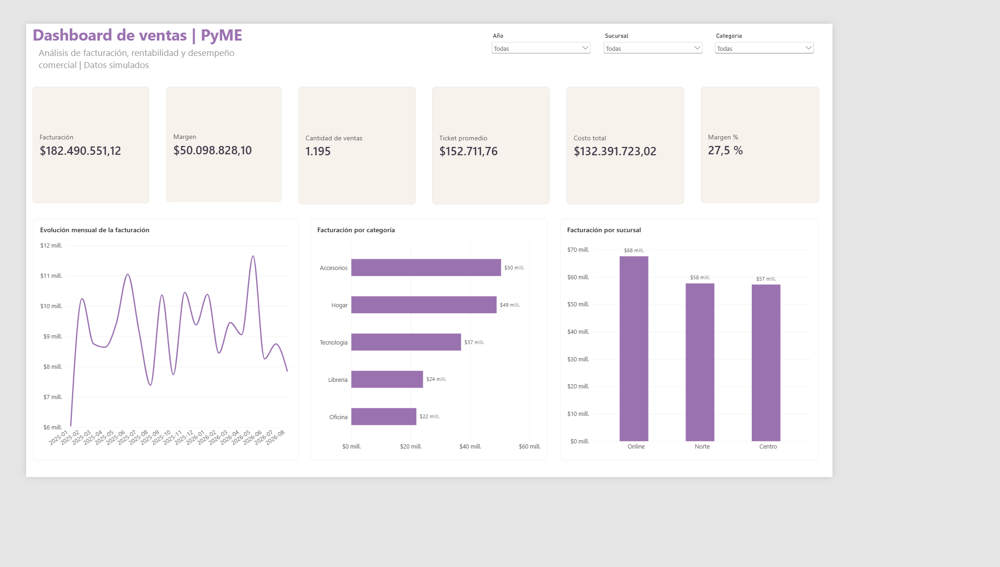

# Dashboard de Ventas PyME | Python, SQL y Power BI

Proyecto integral de análisis de datos orientado a un rol de **Data Analyst / Business Intelligence Jr.** El trabajo recorre todo el proceso: generación de datos, control de calidad, transformación, análisis con SQL, modelado dimensional y construcción de un dashboard ejecutivo en Power BI.

> Los datos son simulados y fueron generados exclusivamente con fines educativos y de portfolio.



## Resumen ejecutivo

| Indicador | Resultado |
|---|---:|
| Operaciones analizadas | 1.195 |
| Facturación total | $182.490.551,12 |
| Costo total | $132.391.723,02 |
| Margen bruto | $50.098.828,10 |
| Margen sobre ventas | 27,5 % |
| Ticket promedio | $152.711,76 |

## Tecnologías utilizadas

- **Python y pandas:** generación, limpieza y validación de datos.
- **SQL y SQLite:** construcción del modelo relacional y consultas analíticas.
- **Power BI:** modelo estrella, relaciones, tabla calendario y visualizaciones.
- **DAX:** medidas dinámicas de facturación, costos, margen y ventas.
- **Git y GitHub:** control de versiones y documentación.

## Flujo del proyecto

1. Se generó un conjunto reproducible de datos sintéticos con errores intencionales.
2. Se validaron tipos, claves, duplicados, valores nulos y reglas de negocio.
3. Se conservaron únicamente los registros válidos y se documentaron los descartes.
4. Se cargaron las tablas en SQLite y se comprobaron los indicadores mediante SQL.
5. Se construyó un modelo estrella y un dashboard interactivo en Power BI.

## Calidad de datos

El archivo original contiene errores controlados para simular un escenario real. El proceso implementado en [`src/limpieza.py`](src/limpieza.py):

- Convierte y valida fechas y columnas numéricas.
- Detecta registros duplicados.
- Controla cantidades, precios, costos y descuentos.
- Verifica la integridad de productos, clientes y sucursales.
- Excluye registros que incumplen al menos una regla.
- Genera un resumen auditable de calidad.

| Control | Cantidad |
|---|---:|
| Filas originales | 1.203 |
| Filas eliminadas | 8 |
| Filas válidas | 1.195 |

El detalle se encuentra en [`data/processed/resumen_limpieza.csv`](data/processed/resumen_limpieza.csv).

## Modelo de Power BI

Se utilizó un modelo estrella compuesto por:

- `FactVentas`: operaciones comerciales.
- `DimProducto`: producto, categoría, costo y precio de lista.
- `DimCliente`: cliente, ciudad, provincia y segmento.
- `DimSucursal`: sucursal y ciudad.
- `DimFecha`: año, trimestre, mes e inicio de mes.

Las medidas DAX calculan facturación, costo total, margen, margen porcentual, cantidad de ventas y ticket promedio. El dashboard permite filtrar por **año**, **sucursal** y **categoría**.

Archivos principales:

- [`powerbi/dashboard_ventas_pyme.pbix`](powerbi/dashboard_ventas_pyme.pbix): informe interactivo.
- [`powerbi/medidas_dax.txt`](powerbi/medidas_dax.txt): tabla calendario y medidas DAX.
- [`powerbi/tema_lila.json`](powerbi/tema_lila.json): tema visual personalizado.
- [`powerbi/guia_dashboard.md`](powerbi/guia_dashboard.md): guía de construcción.

## Hallazgos principales

- **Accesorios** es la categoría con mayor facturación, seguida por Hogar.
- El canal **Online** presenta el mejor desempeño comercial.
- El margen bruto equivale aproximadamente al **27,5 %** de la facturación.
- La facturación mensual muestra variaciones relevantes, sin una tendencia sostenida de crecimiento.
- Los resultados calculados con SQL coinciden con las medidas de Power BI, salvo diferencias mínimas de redondeo.

## Cómo reproducir el análisis

Requisitos: Python 3.10 o superior y Power BI Desktop.

```powershell
git clone https://github.com/rocioaramayo/proyecto-ventas-pyme.git
cd proyecto-ventas-pyme
python -m pip install -r requirements.txt
python src/generar_datos.py
python src/limpieza.py
python src/cargar_sqlite.py
```

Después, se puede abrir [`powerbi/dashboard_ventas_pyme.pbix`](powerbi/dashboard_ventas_pyme.pbix) para explorar el informe interactivo.

## Estructura del repositorio

```text
proyecto-ventas-pyme/
├── data/
│   ├── raw/                 # Datos sintéticos originales
│   └── processed/           # Datos limpios, controles y base SQLite
├── docs/                    # Diccionario de datos y guía SQL
├── images/                  # Captura final del dashboard
├── powerbi/                 # PBIX, medidas DAX, guía y tema visual
├── sql/                     # Esquema y consultas analíticas
├── src/                     # Generación, limpieza y carga de datos
├── requirements.txt
└── README.md
```

## Documentación adicional

- [`docs/diccionario_datos.md`](docs/diccionario_datos.md): campos, tipos y relaciones.
- [`docs/machete_sql.md`](docs/machete_sql.md): explicación de los conceptos SQL utilizados.
- [`sql/analisis_ventas.sql`](sql/analisis_ventas.sql): consultas de análisis.
- [`sql/crear_esquema.sql`](sql/crear_esquema.sql): creación del modelo relacional.

## Próximas mejoras

- Incorporar variación mensual y comparación contra el período anterior.
- Crear una segunda página enfocada en productos y clientes.
- Publicar una versión navegable del informe.
