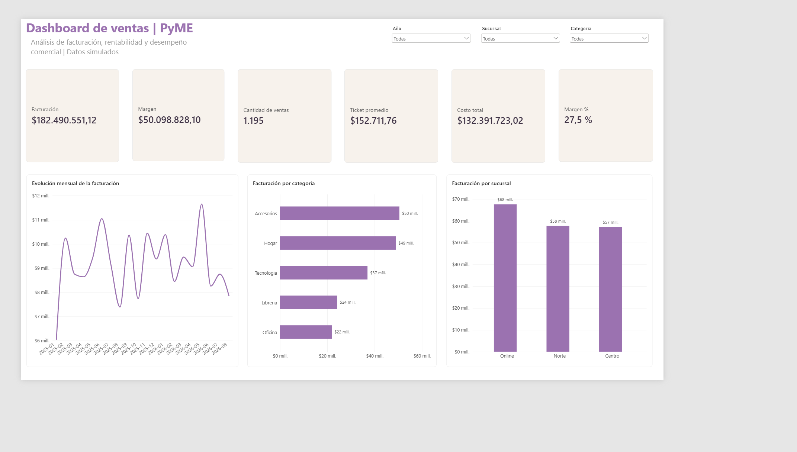

# Análisis de ventas de una pyme

Proyecto de portfolio orientado a un puesto de Data Analyst Jr. El objetivo es transformar datos de ventas con errores en información confiable para analizar facturación, costos, margen, productos, clientes y sucursales.

## Estado del proyecto

- [x] Generación de un conjunto de datos sintético.
- [x] Exploración, limpieza y validación con Python y pandas.
- [x] Documentación de las tablas.
- [x] Base SQLite y análisis con SQL.
- [x] Modelo estrella, tabla calendario y medidas DAX en Power BI.
- [x] Dashboard ejecutivo, filtros interactivos y tema visual personalizado.
- [x] Conclusiones comerciales y captura final.

## Preguntas de negocio

El análisis buscará responder:

1. ¿Cómo evolucionan la facturación y el margen por mes?
2. ¿Qué productos y categorías generan más ventas y margen?
3. ¿Qué sucursales tienen mejor rendimiento?
4. ¿Qué segmentos de clientes compran más?
5. ¿Cuál es el ticket promedio y cómo cambia a lo largo del tiempo?
6. ¿Qué meses presentan crecimiento o caída frente al mes anterior?

## Estructura

```text
proyecto-ventas-pyme/
├── data/
│   ├── raw/                 # Archivos originales
│   └── processed/           # Ventas limpias y resumen de calidad
├── docs/                    # Diccionario de datos y guía SQL
├── images/                  # Capturas del dashboard
├── powerbi/                 # Informe .pbix, medidas DAX, guía y tema
├── sql/                     # Esquema y consultas SQL
└── src/
    ├── generar_datos.py     # Genera datos sintéticos reproducibles
    ├── limpieza.py          # Convierte, valida, filtra y documenta errores
    └── cargar_sqlite.py     # Construye la base SQLite y carga las tablas
```

## Calidad y limpieza

El archivo original contiene errores intencionales para practicar un proceso real de calidad de datos. El programa `src/limpieza.py`:

- Convierte fechas y columnas numéricas.
- Detecta registros duplicados.
- Valida cantidades, precios, descuentos y costos.
- Comprueba que cada producto, cliente y sucursal exista en su tabla maestra.
- Excluye las filas que tengan al menos un problema.
- Genera un resumen auditable de los controles realizados.

Resultados actuales:

- Filas originales: **1.203**.
- Filas eliminadas: **8**.
- Filas válidas: **1.195**.

Las decisiones de limpieza quedan registradas en `data/processed/resumen_limpieza.csv`.

## Cómo reproducirlo

Desde PowerShell:

```powershell
cd "C:\Users\rocio\OneDrive\Desktop\dataScience\Proyecto1\proyecto-ventas-pyme"
python -m pip install pandas
python src/generar_datos.py
python src/limpieza.py
python src/cargar_sqlite.py
```

## Archivos resultantes

- `data/processed/ventas_limpias.csv`: tabla de ventas lista para analizar.
- `data/processed/resumen_limpieza.csv`: cantidad de problemas detectados por control.
- `data/processed/ventas_pyme.db`: base SQLite con el modelo relacional.
- `docs/diccionario_datos.md`: definición de campos y relaciones.
- `docs/machete_sql.md`: explicación de los conceptos SQL utilizados.
- `sql/analisis_ventas.sql`: consultas y preguntas de negocio.
- `powerbi/medidas_dax.txt`: tabla calendario y medidas del dashboard.
- `powerbi/tema_lila.json`: tema visual personalizado.
- `powerbi/guia_dashboard.md`: construcción paso a paso del informe.
- `powerbi/dashboard_ventas_pyme.pbix`: informe interactivo terminado.
- `images/dashboard_ventas_pyme.png`: captura final del dashboard.

## Dashboard de Power BI



El informe utiliza un modelo estrella con `FactVentas` como tabla de hechos y dimensiones de fecha, producto, cliente y sucursal. Incluye:

- Indicadores de facturación, costo, margen, margen porcentual, cantidad de ventas y ticket promedio.
- Evolución mensual de la facturación.
- Comparación de facturación por categoría y sucursal.
- Segmentaciones por año, categoría y sucursal.
- Tema visual personalizado en formato JSON.

Principales conclusiones:

- Se analizaron **1.195 operaciones** por una facturación aproximada de **$182,5 millones**.
- El margen bruto representa aproximadamente el **27,5 %** de la facturación.
- **Accesorios** es la categoría con mayor facturación, seguida por Hogar.
- **Online** es la sucursal o canal con mejor desempeño.
- La evolución mensual presenta variaciones relevantes, sin una tendencia de crecimiento sostenida.

## Primeros resultados SQL

- Ventas válidas analizadas: **1.195**.
- Facturación total: **$182.490.551,03**.
- Margen total: **$50.098.827,98**.
- Ticket promedio: **$152.711,76**.
- Categoría con mayor facturación: **Accesorios**.
- Sucursal con mayor facturación: **Online**.

Estos resultados se utilizarán como referencia para comprobar las medidas de Power BI.

## Posibles mejoras

- Incorporar comparación contra el mes anterior y variación porcentual.
- Crear una segunda página de análisis de productos y clientes.
- Publicar una demostración navegable del informe.
